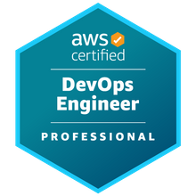
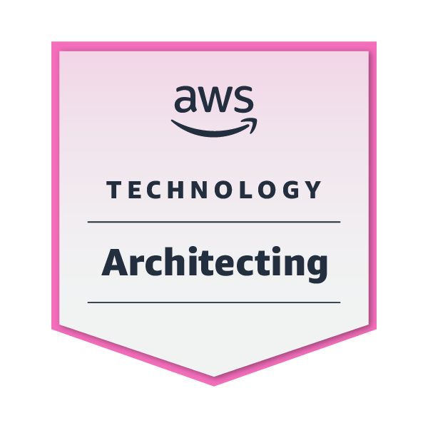
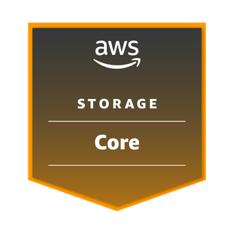
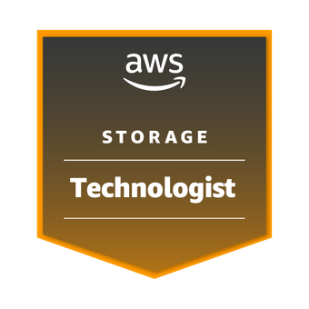

My name is Ricardo Cino, I'm a Solution Software Engineer from the Netherlands with a main focus of building Serverless applications on AWS.

This website is a personal blog where I'm writing about topics that interest me at the moment, which can be around **Privacy**, **Cloud**, **AWS**, **Infrastructure**, **Home Automation**, **Random subjects :)** but most of all about anything in the computer space.

Over the last couple of years I've been collectiong a few certifications in the AWS area and will continue to do so, as that is why most of the content I'm writing is actually going to be about AWS.

* Currently working on achieving the Solutions Architect Professional

